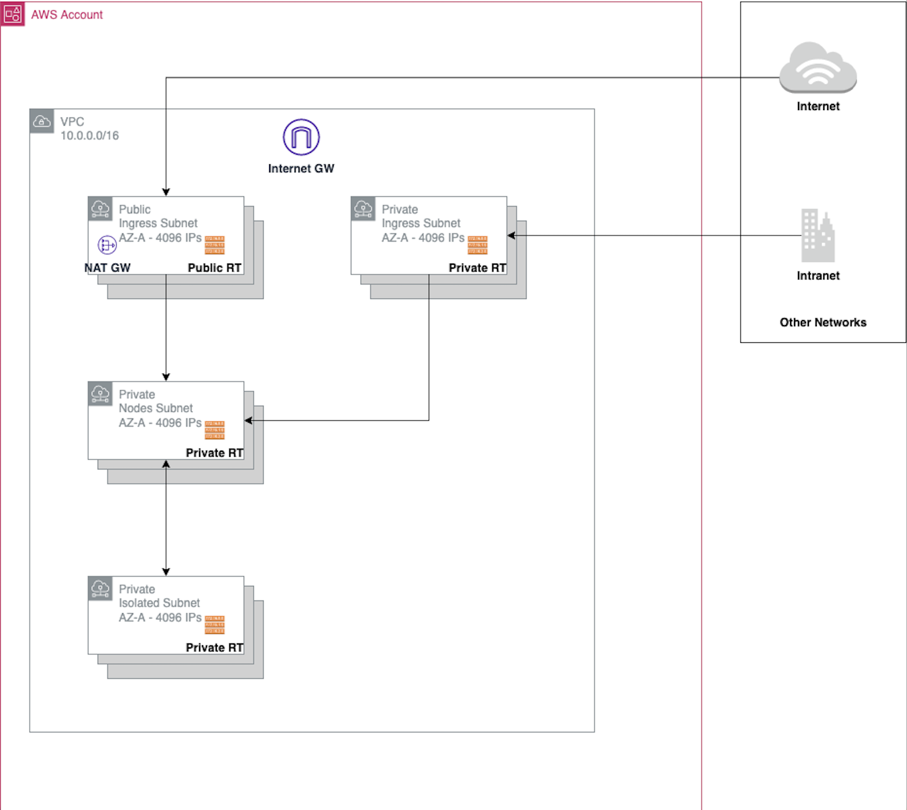
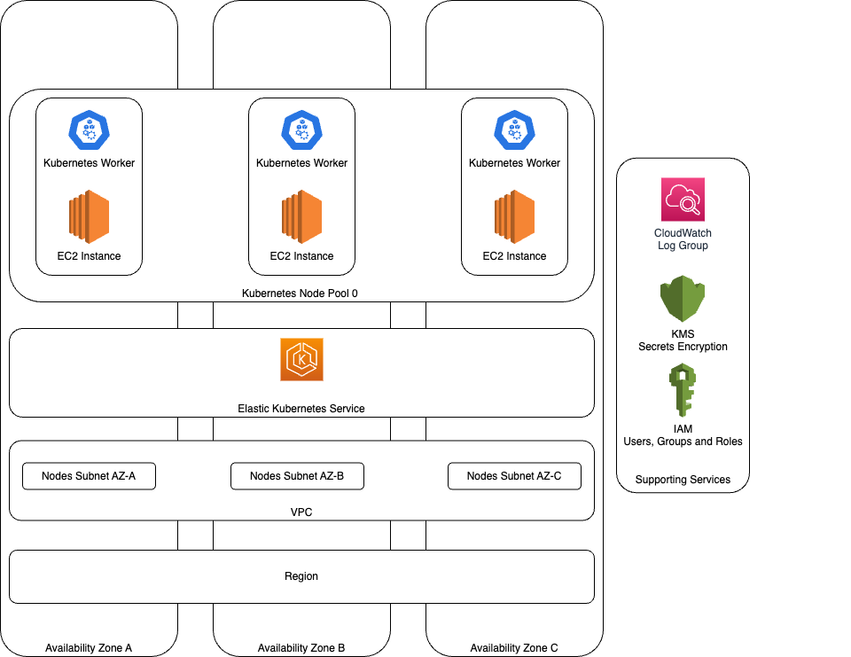

<!-- BEGIN_TF_DOCS -->
# terraform-aws-kubernetes

This repository contains a Terraform Module that implements an architectural blueprint for Kubernetes in AWS.
The fundamental component of this module is Elastic Kubernetes Service (EKS).

## Compatibility

Use this module with Terraform 1.3.0+ version.

## Requirements

The VPC shall allow flexible operations of the network and its resources.

The user deploying this Module shall have Full Administrator permissions in the targeted AWS account.

## Features

* The Module creates and configures a Virtual Private Cloud (VPC) IPv4 network;

* The Module offers the following:

* AWS managed Kubernetes nodes;

* Private and Public ingresses;

* IAM Roles for Service Accounts (IRSA);

* Secret encryption with AWS managed KMS key;

* Built-in security groups to protect the intra-cluster communication.

* The following Kubernetes namespaces have a clear concern:

* *kube-public-ingress*: namespace contains the Ingress Controller that watches for
Ingress objects that have the ingressClass set to public-ingress;

* *kube-private-ingress*: namespace contains the Ingress Controller that watches for
Ingress objects that have the ingressClass set to private-ingress;

* *kube-monitoring*: namespace contains the Prometheus Operator that watches for
ServiceMonitor, PodMonitor, PrometheusRule objects that have set `release:
kube-prometheus-stack` annotation.

* *kube-system*: namespace contains Kubernetes system services and additional self-managed
extensions for EKS.

## Known points of improvement

* Harden the solution for security guidelines;

* Decouple the Helm Provider and Kubernetes provider from EKS authentication and authorization details;

* Harden and improve the reliability of all internal cluster services;

* Enable end-users of this Module to customize the settings for all cluster service;

* Enable the Helm Charts in use to be consumed from a Private Helm Chart repository and Private Container registry.

## Core concepts

* [What is EKS?](https://docs.aws.amazon.com/eks/index.html);

* [What is Kubernetes?](https://kubernetes.io/docs/home/);

* [What is a Networking Spoke?](https://learn.microsoft.com/en-us/azure/cloud-adoption-framework/ready/azure-best-practices/hub-spoke-network-topology);

* [What are the IAM Roles for Service Accounts, as known as IRSA?](https://docs.aws.amazon.com/emr/latest/EMR-on-EKS-DevelopmentGuide/setting-up-enable-IAM.html);

* [How to choose the best EC2 instance type for Kubernetes workers in EKS?](https://docs.aws.amazon.com/eks/latest/userguide/choosing-instance-type.html).

## Repository organization

* [examples](./examples): this folder contains ready to use examples that show how to use this Module;

* [tests](./test): this folder contains a list of automated tests for this Module and examples;

* [lib](./lib): this folder contains a list of local utilities, mostly Makefiles, to support the
contributor's maintenance effort of this Module;

* [modules](./modules): this folder contains a list of local Terraform modules that the Root Module uses;

* [.github](./.github): this folder contains a list of GitHub workflows to support contributions
during change requests and releases of this Module.

## Architecture

### Network organization

This section describes how the networking resources, that are created by this module, are organized at run time.

The Module expects that the given `vpc_cidr` is generous in size to allow the creation of 4 subnet groups. Per subnet group the purpose of
each follows:

* *Public Ingress Subnet Group*: this is an Internet accessible network that will be used by Kubernetes to create ingress
objects that need to be published over the Internet;

* *Private Ingress Subnet Group*: this is a private network that will be used by Kubernetes to create ingress
objects that need to be used over the Intranet;

* *Private Nodes Subnet Group*: this is a private network that will be used by EKS service to deploy the EC2 instances.
This network does not allow direct access from the Internet. The EKS nodes can reach other services over the Internet.
It is required by the AWS managed nodes.

* *Private Isolated Subnet Group*: this is a private network. It does not allow direct access from the Internet and it does
not allow access to the Internet. This network is recommended for local, isolated and self-contained resources.

Notice that upfront planning for the available pool of networking IPs is undeniably mandatory. Avoid constrained networking scalability.
Plan for evolutionary spoke upfront and review how the EKS spoke will look like in 3 years.

### Elastic Kubernetes Service distribution model

This section describes general assumptions when this Module is used to create an EKS-like Kubernetes cluster.

EKS is not a global service. It must be created and hosted in a valid AWS region. Within this region,
this Module manages the network with high-availability considerations in mind.

This module employs three availability zones. The EC2 instances that are part of the Kubernetes nodes pool will be
distributed across them. Any Load Balancer created from within the Kubernetes cluster will be zone redundant as well;
this implies that this type of resource will be identified inside each availability zone by an IPv4 address.

The Kubernetes cluster is designed to include as much as feasible production-like features. This Module enables by default:

* IAM Roles for Service Accounts;

* AWS-managed encryption of the Kubernetes secrets in Etcd;

* Kubernetes API logs.

## Known issues

### Log Group is not cleaned up when the Terraform destroy operation finishes

It is a resource leak that happens in the Terraform AWS Provider during the destroy operation. This happens because
the owner of the Log Group is the EKS cluster that is destroyed before the Log Group can be removed. Ideally it should
be removed while the EKS cluster is still live but because of implicit IAM policy references this is not possible.

### KMS key for secrets encryption becomes inaccessible

Notice that in case of manual deployments and users using multiple roles within an AWS account can induce to
wrong ownership of the KMS key that is used to encrypt the Kubernetes secrets in EKS. Make sure that the deployment
user consistently uses the same role such that to avoid access denied situation on the KMS key.

### The aws_auth config map does not exist

From time to time, during the initial deployment of this module it can happen that the `aws_auth` ConfigMap object is
not created in time and the deployment fails mentioning that the ConfigMap does not exist. At the moment, this issue
is under investigation. To fix, just re-run the deployment.

### The ingress controller does not allow mixed protocols in TCP proxy mode

The Ingress Controller allows to expose Kubernetes application to the world that is outside the Kubernetes cluster.
The in use Ingress Controller (Kubernetes Nginx) allows to specify HTTP and TCP proxies. The main limitation is related
with the TCP proxies which do not support mixed protocols. It is possible to use only TCP or only UDP.

Check out this [example](./examples/configure-ingress-proxy-ports/main.tf) for details.

## Usage guides

Refer to this [page](./docs/GUIDES.md) for details in regard to cluster services usage instructions.

## Contribution guides

Refer to this [page](./CONTRIBUTING.md) for details in regard to contribution instructions.

## Requirements

| Name | Version |
|------|---------|
|  [terraform](#requirement\_terraform) | >= 1.3.0 |
|  [archive](#requirement\_archive) | >= 2.2.0 |
|  [aws](#requirement\_aws) | >= 4.47.0 |
|  [helm](#requirement\_helm) | >= 2.7.0 |
|  [kubectl](#requirement\_kubectl) | >= 1.14.0 |
|  [kubernetes](#requirement\_kubernetes) | >= 2.18.0 |
|  [random](#requirement\_random) | >= 3.1 |
## Providers

| Name | Version |
|------|---------|
|  [aws](#provider\_aws) | >= 4.47.0 |
|  [kubernetes](#provider\_kubernetes) | >= 2.18.0 |
|  [time](#provider\_time) | n/a |
## Resources

| Name | Type |
|------|------|
| [time_sleep.wait_5_min_and_allow_kubernetes_cluster_to_initialise](https://registry.terraform.io/providers/hashicorp/time/latest/docs/resources/sleep) | resource |
| [aws_eks_cluster_auth.this_cluster](https://registry.terraform.io/providers/hashicorp/aws/latest/docs/data-sources/eks_cluster_auth) | data source |
| [kubernetes_resource.kube_monitoring_prometheus_operator_discovery_label](https://registry.terraform.io/providers/hashicorp/kubernetes/latest/docs/data-sources/resource) | data source |
| [kubernetes_service_v1.kube_private_ingress_svc_url](https://registry.terraform.io/providers/hashicorp/kubernetes/latest/docs/data-sources/service_v1) | data source |
| [kubernetes_service_v1.kube_public_ingress_svc_url](https://registry.terraform.io/providers/hashicorp/kubernetes/latest/docs/data-sources/service_v1) | data source |
## Inputs

| Name | Description | Type | Default | Required |
|------|-------------|------|---------|:--------:|
|  [environment](#input\_environment) | Specify the environment name.  Use this attribute to give meaning to the EKS cluster and its related resources. | `string` | `"try-out"` | no |
|  [kubernetes\_api\_allow\_network\_access\_from](#input\_kubernetes\_api\_allow\_network\_access\_from) | Specify a list of source IPv4 addresses that can initiate a network authentication with the Kubernetes API.  Important | `list(string)` | <pre>[   "0.0.0.0/0" ]</pre> | no |
|  [kubernetes\_api\_logs](#input\_kubernetes\_api\_logs) | Specify if it is desirable to persist the logs of the Kubernetes API in a CloudWatch Log Group. Define for how long to persist the logs and also specify what logs to persist. | <pre>object({     create_cloudwatch_log_group            = bool     cloudwatch_log_group_retention_in_days = number     cluster_enabled_log_types              = list(string)   })</pre> | <pre>{   "cloudwatch_log_group_retention_in_days": 14,   "cluster_enabled_log_types": [     "api",     "audit",     "authenticator",     "controllerManager",     "scheduler"   ],   "create_cloudwatch_log_group": true }</pre> | no |
|  [kubernetes\_api\_version](#input\_kubernetes\_api\_version) | Specify the version of the Kubernetes API. | `string` | `"1.23"` | no |
|  [kubernetes\_cluster\_admin\_iam\_roles](#input\_kubernetes\_cluster\_admin\_iam\_roles) | Specify a list of IAM roles that will administer the cluster across all Kubernetes namespaces.  By default allow every engineer in the AWS account to have administrative access to the cluster. | `list(string)` | <pre>[   "*" ]</pre> | no |
|  [kubernetes\_cluster\_services\_configs](#input\_kubernetes\_cluster\_services\_configs) | Specify that details that allow to adjust the configuration of the cluster services. Notice that at the moment, the public and private ingress controller does not support mixed protocols at the LoadBalancer level.  Example:   {     kube\_private\_ingress\_set\_values = [       {           name  = "tcp.8080"           value = "default/svc:8080"       },       {           name  = "tcp.8081"           value = "kube-system/not-existent:8888"       }     ]     kube\_public\_ingress\_set\_values = ...   } | <pre>object({     kube_private_ingress_set_values = optional(list(any))     kube_public_ingress_set_values  = optional(list(any))   })</pre> | <pre>{   "kube_private_ingress_set_values": [],   "kube_public_ingress_set_values": [] }</pre> | no |
|  [kubernetes\_cluster\_worker\_pools](#input\_kubernetes\_cluster\_worker\_pools) | Specify the configuration for the worker pools. By default there is one pool, named blue. It uses Linux EC2 instances. The capacity is `spot`.  It is possible to overwrite the default pool as well. | `any` | <pre>{   "blue": {     "capacity_type": "ON_DEMAND",     "desired_size": 5,     "instance_types": [       "t3a.2xlarge"     ],     "labels": {       "pool-color": "blue"     },     "max_size": 5,     "min_size": 5,     "update_config": {       "max_unavailable_percentage": 50     }   } }</pre> | no |
|  [kubernetes\_packages\_as\_helm\_charts](#input\_kubernetes\_packages\_as\_helm\_charts) | Specify a list of packages to install in the Kubernetes cluster as soon as it is ready. | <pre>list(object({     namespace  = string     repository = string     repository_config = optional(object({       repository_key_file  = optional(string)       repository_cert_file = optional(string)       repository_ca_file   = optional(string)       repository_username  = optional(string)       repository_password  = optional(string)     }))     app = object({       name                       = string       chart                      = string       version                    = string       force_update               = optional(bool)       wait                       = optional(bool)       recreate_pods              = optional(bool)       max_history                = optional(number)       lint                       = optional(bool)       cleanup_on_fail            = optional(bool)       create_namespace           = optional(bool)       disable_webhooks           = optional(bool)       verify                     = optional(bool)       reuse_values               = optional(bool)       reset_values               = optional(bool)       atomic                     = optional(bool)       skip_crds                  = optional(bool)       render_subchart_notes      = optional(bool)       disable_openapi_validation = optional(bool)       wait_for_jobs              = optional(bool)       dependency_update          = optional(bool)       replace                    = optional(bool)     })     values = optional(any)     params = optional(list(object({       name  = string       value = any     })))     secrets = optional(list(object({       name  = string       value = any     })))   }))</pre> | `null` | no |
|  [name](#input\_name) | Overwrite the prefix name that is used internally to name the resources.  Use this attribute when and only when this module was already delployed in the desired AWS account. | `string` | `"kube"` | no |
|  [region](#input\_region) | Specify the name of the location where the resources of this module will be created.  This name must be a valid AWS region name. | `string` | `"eu-west-1"` | no |
|  [tags](#input\_tags) | Specify a list of tags as key/value pairs. These tags will be applied to all resources created by this module. | `map(any)` | `{}` | no |
|  [vpc\_cidr](#input\_vpc\_cidr) | Specify the networking set of addresses for Kubernetes. Use the prefix notation.  Ref: https://www.rfc-editor.org/rfc/rfc4632#section-3.1 | `string` | `"10.0.0.0/16"` | no |
|  [vpc\_nat\_gateway\_type](#input\_vpc\_nat\_gateway\_type) | Specify the type of the NAT Gateway.  Ref: https://docs.aws.amazon.com/vpc/latest/userguide/vpc-nat-gateway.html | `string` | `"one_nat_gateway_per_az"` | no |
## Outputs

| Name | Description |
|------|-------------|
|  [eks\_cluster](#output\_eks\_cluster) | Elastic Kubernetes Service (EKS) cluster attributes. |
|  [kubernetes\_api](#output\_kubernetes\_api) | URL, Version of the Kubernetes API and Kubernetes cluster name. |
|  [kubernetes\_api\_certificate\_authority\_data](#output\_kubernetes\_api\_certificate\_authority\_data) | Base64 encoded certificate data required to communicate with the cluster. |
|  [kubernetes\_cluster\_services](#output\_kubernetes\_cluster\_services) | Details about the cluster services. |
|  [kubernetes\_secrets\_managed\_encryption\_key](#output\_kubernetes\_secrets\_managed\_encryption\_key) | The cluster comes with enabled by default Kubernetes secrets. This object     contains the attributes related with the encryption key used by AWS. |
|  [region](#output\_region) | Region name of the deployment |
|  [subnet\_cidr\_blocks\_per\_type](#output\_subnet\_cidr\_blocks\_per\_type) | Allocated network prefixes grouped per purpose. |
|  [subnet\_ids\_per\_type](#output\_subnet\_ids\_per\_type) | List of subnet ids per type. |
|  [tags](#output\_tags) | List of tags that are applied to internal resources. |
|  [vpc\_arn](#output\_vpc\_arn) | ARN of the VPC. |
|  [vpc\_id](#output\_vpc\_id) | Id of the VPC. |
<!-- END_TF_DOCS -->